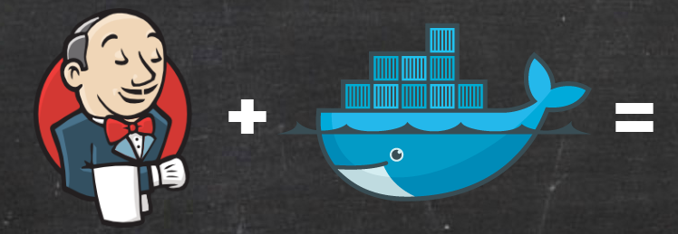

# DOCKER & JENKINS від RIOT GAMES
27.08.2015

[DOCKER & JENKINS](https://technology.riotgames.com/news/thinking-inside-container?_gl=1*1mhd0ud*_ga*MjA1OTg5MDYyMy4xNzEwNTI0MTc5*_ga_7VLGVTHBTW*MTcxMjMzNjUzMi4xMS4wLjE3MTIzMzY1MzIuMC4wLjA.)

РОЗДІЛ I - Мислення всередині контейнера

РОЗДІЛ II - Поміщення Jenkins в контейнер Docker _(ВИКОНАНО)_

РОЗДІЛ III - Docker & Jenkins: дані, які зберігаються _(ВИКОНАНО)_

РОЗДІЛ IV - Jenkins, Docker, Proxies і Compose _(ВИКОНАНО)_

РОЗДІЛ V - Контроль над вашим образом Docker _(ВИКОНАНО)_

РОЗДІЛ VI - Створення за допомогою Jenkins в ефемерному контейнері Docker _(ВИКОНАНО)_

РОЗДІЛ VII - Підручник: Створення за допомогою Дженкінса всередині ефемерного контейнера Docker _(ВИКОНУЄТЬСЯ)_

РОЗДІЛ VIII - DockerCon Talk і історія 

# Тримайте Docker у чистоті

    docker system df

образи (images) – загальний розмір образів, які були завантажені зі сховищ образів та побудовані у вашій системі

контейнери (containers) – загальний обсяг дискового простору, використовуваний запущеними контейнерами (мається на увазі загальний обсяг верств читання-запису всіх контейнерів)

локальні томи (local volumes) – обсяг локальних сховищ, примонтованих до контейнерів

кеш складання (build cache) – тимчасові файли, згенеровані процесом побудови образів (при використанні інструменту BuildKit, доступного починаючи з Docker версії 18.09)

Видалення контейнерів

    docker container prune

Видалення образів

    docker image prune

Видалення локальних томів

    docker volume prune

Видалення кешу

    docker builder prune

Повністю очистити кеш Docker

    docker system prune -a