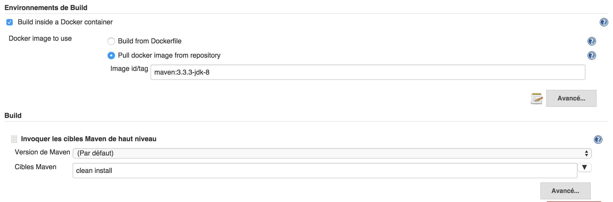
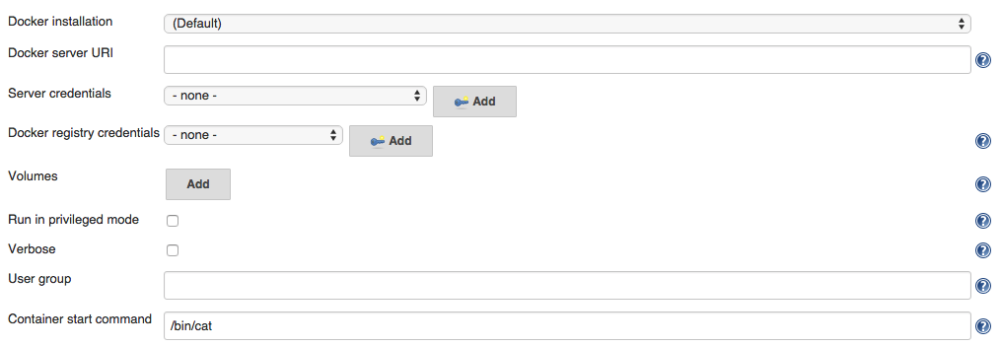
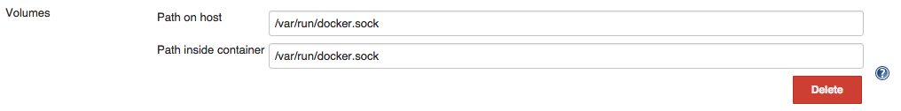

# Створення за допомогою Jenkins в середині ефемерного контейнера Docker

Різні підходи до запуску збірок із Jenkinsом усередині контейнерів

Які рішення ми прийняли як команда і чому

Уроки, які ми отримали під час роботи з нашою платформою

Контекст для детального підручника про те, як створити власні ефемерні середовища збірки за допомогою Jenkins

Як створити це налаштування, якщо ви хочете використовувати його як свій основний сервер Jenkins замість локального сервера розробки

Мислення всередині контейнера також означає створення всередині нього. Сьогодні я хотів би розповісти про те, як моя команда зараз об’єднує Jenkins і Docker для обслуговування команд Riot Engineering. У відповідній публікації я пообіцяв, що обговорю фактичну підлеглу збірку та конфігурацію Jenkins безпосередньо. У певному сенсі це головна подія — якщо у вас немає сервера Jenkins, готового приймати підлеглі пристрої, варто повернутися до попередніх публікацій . 

Однак перед тим, як розпочати навчальний посібник, давайте поговоримо про підхід та альтернативи. Існує багато способів використання контейнерів Docker як підлеглих пристроїв. Навіть звужуючи поле до простого використання їх на Jenkins, все одно є багато варіантів. Завдяки моїм дослідженням і відкриттям я вважаю, що ви можете застосувати два основні підходи. Концептуально я буду називати їх моделями «виконання Docker» і «Ephemeral Slave» Docker.

Ці два підходи мають коріння в тому, як Jenkins підключається та спілкується з вашим підлеглим комп’ютером. У моделі виконання Jenkins підключається традиційним способом: запускаючи агент на існуючій віртуальній машині або фізичному обладнанні, де він очікує запущений хост Docker. У ефемерній моделі Jenkins безпосередньо підключається до контейнера Docker і розглядає його як підлеглий комп’ютер. Різниця між двома варіантами є важливою, тому давайте трохи розберемо кожен із них. 

# I. МОДЕЛЬ ВИКОНАННЯ DOCKER

У моделі виконання ми архітектурно припускаємо, що підлеглий пристрій є хостом Docker, але розглядаємо його як фізичну машину. Коли запускається завдання Jenkinsа, воно синхронізує/створює робочий каталог безпосередньо на підлеглому пристрої, використовує команди docker run і docker exec для запуску контейнера, а потім монтує його локальний робочий простір усередині. Контейнер є віртуальним блокнотом і ізольованим середовищем. Він може містити всі спеціальні версії інструментів і двійкових файлів, які нам потрібні для компіляції вихідного коду, який ми змонтували в контейнер.

Після завершення роботи зі збирання всі створені ним двійкові файли та артефакти збірки будуть на підпорядкованому пристрої в традиційному робочому просторі Jenkins. Jenkins може безпечно вимкнути контейнер і виконати будь-яке очищення після збирання, як зазвичай.

Цю модель найкраще представляє Cloudbees Custom Build Environment Plugin , який є відкритим кодом і підтримується власниками сховища вихідних кодів Jenkins. 

# Спеціальне середовище збірки CloudBees Docker

Основні вимоги до безперервної інтеграції/доставки на основі Дженкінса налаштування є:

    Переконайтеся, що середовище збірки/тестування точно відтворюється з a попередньо визначені налаштування.

    Переконайтеся, що середовище збірки/тестування добре ізольовано від інших збірок виконується на одній інфраструктурі.

Docker — це чудовий спосіб завантаження відтворюваного та ізольованого середовищ. Порівняно з віртуальною машиною його швидше запускати та легший у використанні. Ще одна перевага полягає в тому, що образ Docker можна визначити обидва як бінарне зображення, отримане зі сховища, або як простий текстовий файл Docker ви можете зберігати в SCM поруч із вихідним кодом проекту, щоб джерело та середовище завжди синхронізовані та записані.

CloudBees Docker Custom Build Environment Plugin розроблено для створити зображення Docker / Dockerfile першого класу громадянина в установці безперервної доставки, що дозволяє найпростішим способом для команди розробників для керування точними частинами середовища збірки в той час як команда інфраструктури має зосередитися лише на доступних ресурсах розміщення довільних контейнерів докерів. 

КЕРІВНИЦТВО КОРИСТУВАЧА

CloudBees Docker Custom Build Environment Plugin можна використовувати з будь-якого тип завдання, він з’являється в розділі «середовище збірки» і дозволяє вам налаштуйте свою збірку для запуску всередині контейнера Docker.

Ти можеш :

    щоб запустити збірку як образ Docker Виберіть образ Docker , витягнув. Це можна порівняти з докер-плагін підхід, щоб запропонувати рабів-докерів у Jenkins, але без будь-яких передумови для образу Docker і не потребують адміністратора привілеї для налаштування відповідного підлеглого шаблону.
    
    Налаштуйте плагін для створення образу контейнера з a Файл Docker зберігається в репозиторії проекту. З цим налаштуванням ви отримуєте як вихідний код проекту, так і середовище побудови, визначені в SCM. Це мій спосіб використання цього плагіна.

Перевірка SCM виконуватиметься в класичному підлеглому контексті виконання Jenkins - це потрібно для доступу до Dockerfile проекту, а потім для створення та запуску необхідний контейнер. 

ВИКОРИСТАННЯ ЗОБРАЖЕННЯ DOCKER

Спеціальне середовище збірки CloudBees Docker дозволяє використовувати довільний докер зображення для розміщення збірки. Ви можете використовувати такий імідж, який створили самостійно (або за допомогою CloudBees Docker Build і Опублікувати плагін), щоб визначити набір передумов для вашого проекту та поділитися з командою розробників, а також для повторного використання для вашої роботи CI. в У наступному прикладі зображення maven+jdk8, доступне на DockerHub, використовується як a еталонне середовище для розміщення збірки maven. 

ВИКОРИСТАННЯ Doker

Ви також можете мати Dockerfile і контекст, збережений у вашому проекті SCM окрім вашого вихідного коду, щоб команда могла підтримувати їх разом та/або використовувати окремий файл Docker для кожної гілки. Якщо ви використовуєте цей параметр, CloudBees Docker Спеціальне середовище збірки створюватиме образ під час першої збірки, а потім порівняє ваш файл Docker з файлом, який використовувався в попередній збірці перевірте, необхідна перебудова.

Що стосується зображень Docker, немає жодних вимог щодо файлу Docker, яким ви є використовуючи.

РОЗШИРЕНІ ОПЦІЇ

CloudBees Docker Custom Build Environment інтегрується з Docker-commons плагін, щоб ви могли визначити виконуваний файл docker cli для використання взаємодіяти з демоном Docker, а також вибрати облікові дані TLS використовується для доступу до захищеної інфраструктури (що настійно рекомендується) 

    Параметр Verbose дозволяє створювати дамп докер-кліту в журнал збірки вихід команди. Це в основному призначено для діагностичних цілей. 

ОБСЯГИ

Контейнер збірки запускається з робочою областю Project у всьому Jenkins Home встановлено всередині контейнера, щоб ваші інструменти збірки мали доступ до роботи SCM копіювати та створювати двійкові файли/звіти. Тимчасовий каталог також є встановлено, оскільки багато плагінів покладаються на нього для передачі команд або файли облікових даних, які видаляються після завершення збірки.

Ви можете налаштувати додаткові каталоги для монтування в контейнер, a звичайним випадком використання є зберігання локального кешу диспетчера залежностей артефакти на хості виконавця, тому вам не доведеться завантажувати їх знову та знову для кожної збірки. 

ГРУПА КОРИСТУВАЧІВ

Дизайн плагіна вимагає, щоб користувач, який виконує команди збірки, був однаковим як користувач підлеглого агента jenkins, тому jenkins може керувати файлами, створеними в Робоча область без проблем з дозволом. Оскільки Docker (поки що) не робить підтримка простору імен користувача, без нього неможливо використовувати окремого користувача порушення робочого простору в якийсь момент. Для деяких випадків використання це головне проблема, оскільки контейнер розроблено з певними встановленими дозволами користувач.

Як обхідний шлях можна визначити групу для користувача, який виконує команди під час збірки та налаштуйте цю групу у своєму контейнері за допомогою адекватні дозволи. 

DOCKER в DOCKERi

Іноді ваша збірка потребуватиме створення інших контейнерів Docker, для зразка для завантаження тестової бази даних, яка використовується вашими інтеграційними тестами.

Docker дозволяє розмістити демон докерів у контейнері докерів, відомий як « Docker в Docker ». Ви можете використовувати образ докера jpetazzo/dind (або похідний), але його потрібно буде запустити контейнер із розширеним дозволом («привілейований режим»), який ви повинні подумайте двічі, оскільки це має значний вплив на безпеку. Це також вимагають певних налаштувань у конфігурації плагіна, тому використовувалася команда завантажте контейнер, виконайте налаштування демона докера:

    працювати в привілейованому режимі
    
    встановити команду запуску для запуску wrapdocker
    
    налаштуйте плагін для запуску в групі 'docker', щоб мати доступ сокет докера.

Будь ласка, зверніть увагу: це ваша відповідальність за отримання docker cli виконуваний файл у вашому контейнері. Найпростіший варіант — включити ці рядки у вашому Dockerfile:

RUN wget https://get.docker.io/builds/Linux/x86_64/docker-latest -O /bin/docker
RUN chmod +x /bin/docker

На етапі збирання у вашому завданні ви можете запускати докер-контейнери як ви б з командного рядка. Якщо контейнер, який ви починаєте, потрібен ділитися файлами зі збіркою, ви можете налаштувати її для монтування обсяги, які використовуються вашим контейнером збірки. Скажімо, для зразка у вас є a образ докера для сервера програм, який очікує як параметр запуску шлях до пакету WAR програми. Потім ви можете запустити:

docker run --volumes-form $BUILD_CONTAINER_ID application_server_docker_image $WORKSP

ЗМІНА СЕРЕДОВИЩА

плагін надає змінну BUILD_CONTAINER_ID під час збирання, щоб ви за потреби може посилатися на контейнер, у якому розміщено збірку. 
